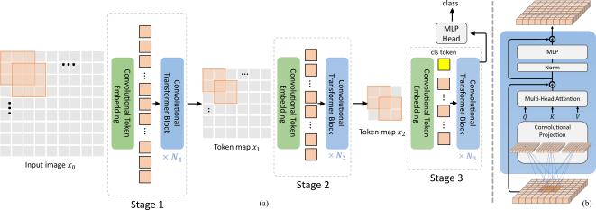

# Introduction
Re-train CNN, ViT, and CvT models from scratch on a small-scale dataset such as CIFAR-100 to compare the performance of these advanced architectures. Implement ResNet-18, ViT-B, CvT-13, CvT-21, and construct a custom CvT-9 model with a parameter count approximately equal to that of ResNet-18.



# Main results
## Top-1 accuracy(%) of CvT, ViT and ResNet18, trained from scratch on Cifar100 datasets.
| Model  | Param (M) | Acc (%) | Time/epoch (s) |
|--------|------------|-------|--------|
| ResNet18 | 12 | 72.93 | 168 |
| ViT-B | 86    | 48.65   | 1286    |
| CvT-13 | 20    | 60.76   | 656    |
| CvT-21 | 31    | 59.72   | 857   |
| CvT-9 | 12    | 62.39  | 524   |

# Quick start
## Installation
Assuming that you have installed PyTorch and TorchVision, if not, please follow the [officiall instruction](https://pytorch.org/) to install them firstly. 
Intall the dependencies using cmd:

``` sh
python -m pip install -r requirements.txt --user -q
```

## Run
Each experiment is defined by a yaml config file, which is saved under the directory of `experiments`. The directory of `experiments` has a tree structure like this:

``` sh
python train_cvt_cifar100
```

OR

``` sh
python train_vit_cifar100
```

OR,
Click button 'RUN"/'RUN ALL'

Note: change the import between model files in the train file to run different types of models.
